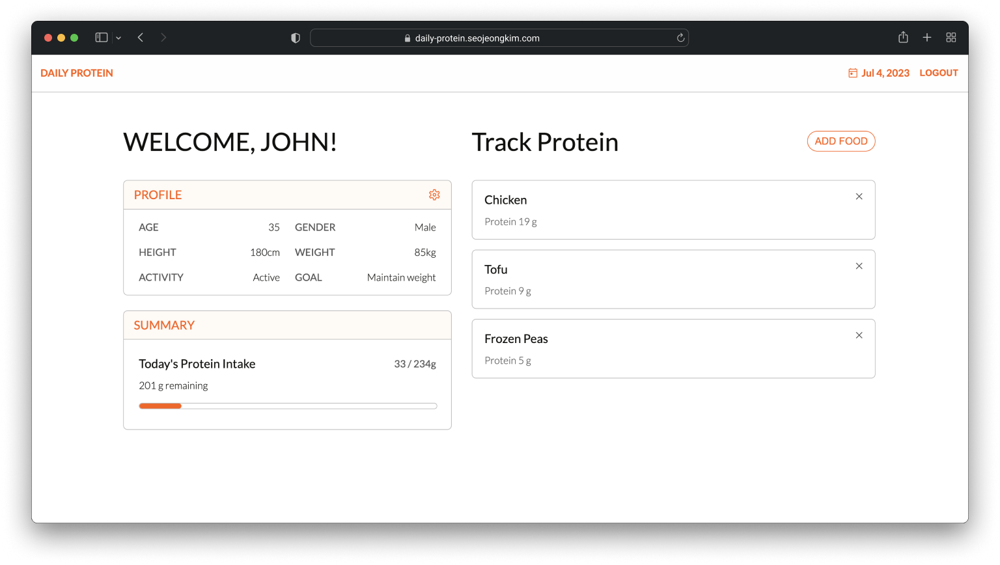

<!-- PROJECT OVERVIEW -->
 

  <h1 align="center">Daily Protein</h1>

  

    SPA that users can sign up, calculate, and track daily protein intake.
     
     
    <a href="https://daily-protein.seojeongkim.com/" target="_blank">View Live Demo</a>
    ·
    <a href="https://github.com/jennysujukim/daily-protein-2023">Explore Docs</a>
  

<!-- TABLE OF CONTENTS -->
## 📗 Table of Contents
- [About Project](#about-project)
- [Built With](#🛠-built-with)
- [Roadmap](#🔭-roadmap)
- [Live Demo](#🚀-live-demo)
- [Acknowledgments](#🙏-acknowledgments)
- [License](#📝-license)
- [Contact](#📨-contact)

<!-- ABOUT PROJECT -->
## 📖 About Project 
Daily Protein is a user-friendly Single Page Application that helps users in monitoring their daily protein intake. With Daily Protein, users can effortlessly calculate their required protein amount for each day and set targets to track their progress by searching and logging meals on the app.

### Key Features
- Sign up / Sign in account
- Save and update personal diet data 
- Calculate daily protein intake
- Search foods to retrieve detailed nutrition info
- Add foods to personal dashboard and track protein intake

(<a href="#readme-top">back to top</a>)

<!-- BUILT WITH -->
## 🛠 Built With 

> Frontend

     &nbsp;
     &nbsp;

> Serverside / Database

     &nbsp;
     &nbsp;

(<a href="#readme-top">back to top</a>)

<!-- ROADMAP -->
## 🔭 Roadmap 
- [X] Create client side view with React.js and Sass 
- [X] Connect Firebase Firestore to communicate data
- [X] Connect Firebase Auth to authenticate user
- [ ] Update style with Material UI
- [ ] Apply typescript
- [ ] Migrate data to Mongo DB and create server with Express 

(<a href="#readme-top">back to top</a>)

<!-- LIVE DEMO -->
## 🚀 Live Demo 
- [Live Demo Link](https://daily-protein.seojeongkim.com/)

(<a href="#readme-top">back to top</a>)

<!-- ACKNOWLEDGEMENTS -->
## 🙏 Acknowledgments

* [Edamam Food database API](https://developer.edamam.com/food-database-api)
* [Bodybuilding Protein Calculator](https://www.bodybuilding.com/fun/calpro.htm)
* [Firebase Github open source code](https://github.com/firebase/)

(<a href="#readme-top">back to top</a>)

<!-- LICENSE -->
## 📝 License

Distributed under the MIT License. See `LICENSE.md` for more information.

(<a href="#readme-top">back to top</a>)

<!-- CONTACT -->
## 📨 Contact

- **Jen Kim** - [@jenny_seojeong_kim](https://www.linkedin.com/in/jenny-seojeong-kim/) - hello@seojeongkim.com

- **Come to see more projects** - [Portfolio](seojeongkim.com)

(<a href="#readme-top">back to top</a>)

